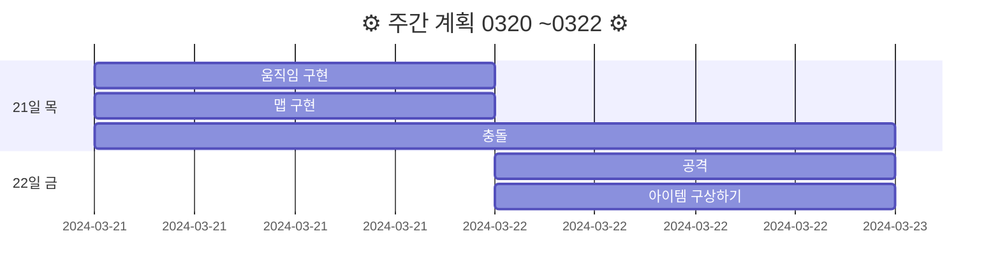
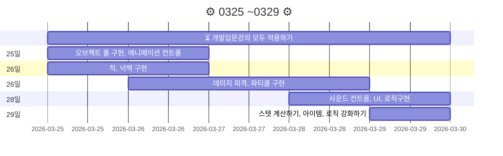

# 20240320FinalProject
> 기간 : 2024.03.20 ~ 05.02
- 프로젝트 명 : **Retro RPG**
- 장르 :  **MMORPG**(대규모 다중 사용자 온라인 롤플레잉 게임)
- 2D/3D : **2D**   

    
🛠 프로젝트 구현 계획  
 

### 필수 구현사항을 먼저 구현하고 시간이 남으면 선택 사항까지 구현 

`게임 개발 입문 강의의 TopDown방식으로 제작하고 아래 요소를 추가 `    

- 필수 구현:
    - [x] 개발 입문 강의를 기초로 TopDown rpg만들기(기초적인 게임 뼈대)
    - [ ] 개발 입문 강의의 케릭터에 새로운 무기와 아이템으로 변경
    - [ ] 개발 입문 강의의 UI와 맵 등을 변형해서 사용해 보자
    - [ ] `개발 입문 강의에서 다룬 다양한 아이템 적용하기 `
        - --> 구체적으로 작성하기

    - [ ] 숙련과정에 나온 인벤토리 적용하기(아이템과 상호작용)  

 

- 추가 선택 구현
    - [ ] webgl로 빌드(pc나 안드로이드보다 오류가 많아서 추가 구현사항으로)
    - [ ] 심화과정의 photon으로 멀티플레이어 적용하기
    - [ ] 멀티플레이를 위한 포톤추가(포톤 20명까지 무료)
    - [ ] 모바일에서도 호환되게 터치와 조이스틱 키 추가

    

###### RPG 제작하는 팀 참고: 12,13,15,18,19조  
---  

> 완료, 진행중, 해야할 것으로 구분 해 보기  
> 0321: 개발 입문 강의에서 다룬 다양한 아이템 적용하기 --> 아이템에 대해서 더 세분화 해서 작성 해 보기  

 

### `📝 개발일지  `

|`0320 ~ 0322`|`문제점`|
|--|--|
|[0320:프로젝트 시작](storageFiles/schedule/0320.md)|[0320:문제](storageFiles/trouble/0320Trb.md)|
|[0321:이동,맵 구현하기](storageFiles/schedule/0321.md)|[0321:이동문제](storageFiles/trouble/0321T.md)|
|[0322:아이템정리하기](storageFiles/schedule/0322.md)||

|`0325 ~ 0329`| `문제점`|
|------------------|------------------|
|0325           |           |
|0326           |           |
|0327           |           |
|    0328       |           |
|        0329   |           |

---

### `🧾 참고 자료들 : `
케릭터,맵,아이템,효과   :  [Assets](storageFiles/References/ref_character_map_fx.md)  
사운드 :  [🔊Audio](storageFiles/References/ref_sound.md) 

---  

