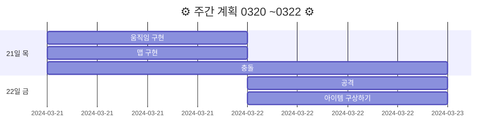
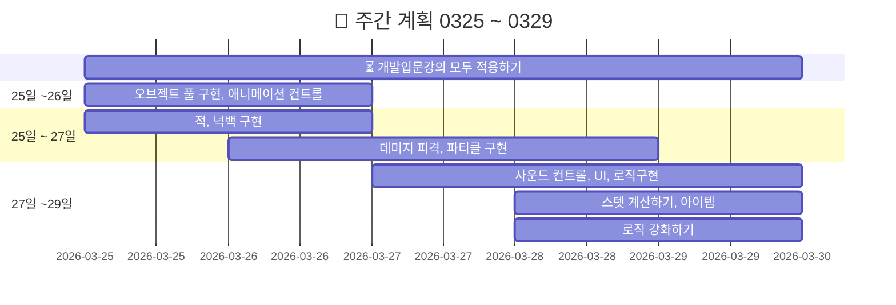
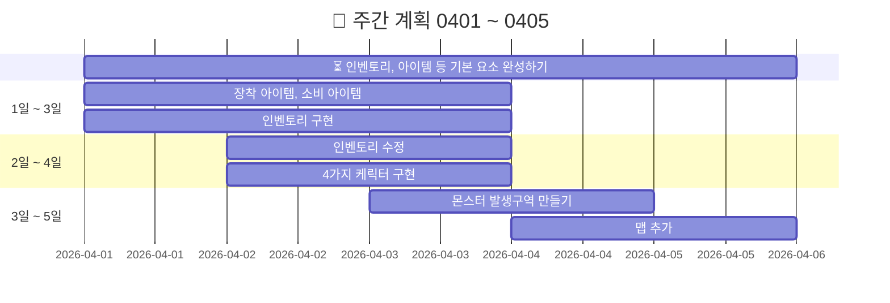
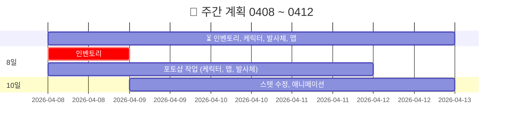

<!-- 주석 -->
<!-- 주석 
```
[](https://hits.seeyoufarm.com)
```


-->


# 20240320FinalProject

<!-- 
[](https://hits.seeyoufarm.com)
-->

> `기간 : 2024.03.20 ~ 05.02`
>- 프로젝트 명 : **Retro RPG**
>- 장르 :  **MMORPG**(대규모 다중 사용자 온라인 롤플레잉 게임)
>- 2D/3D : **2D**


<details >
    <summary >🛠 프로젝트 구현 계획  </summary> 

### 필수 구현사항을 먼저 구현하고 시간이 남으면 선택 사항까지 구현 

`게임 개발 입문 강의의 TopDown방식으로 제작하고 아래 요소를 추가 `    


- 필수 구현:
    - [x] 개발 입문 강의를 기초로 TopDown rpg만들기(기초적인 게임 뼈대)
    - [x] 개발 입문 강의의 케릭터에 새로운 무기와 아이템으로 변경
    - [x] 개발 입문 강의의 UI와 맵 등을 변형해서 사용해 보자
    - [x] 개발 입문 강의에서 다룬 다양한 아이템 적용하기  
    - [ ] ❌ 숙련과정에 나온 인벤토리 적용하기(아이템과 상호작용) :  
---> `2주 정도 시도했지만 기본 지식의 부족으로 포기하고 다른 부분을 먼저 구현하기로 결정 `

<br>

- 추가 선택 구현
    - ✅ webgl로 빌드(pc나 안드로이드보다 오류가 많아서 추가 구현사항으로)
    - ❌ 멀티플레이를 위한 포톤추가(포톤 20명까지 무료)
    - ❌ 모바일에서도 호환되게 터치와 조이스틱 키 추가


</details>    

action - batch - gif

<br>  

[](https://s8st.github.io/20240320FinalProject/8/index.html)


### `시연영상`  
https://github.com/s8st/20240320FinalProject/assets/153998744/d6f3055d-0a8b-4817-b821-0184222928ba  


<br>  

---  
<details >
    <summary > 🔜 브로셔 및 발표 자료, 리드미  </summary> 

### 깃허브 리드미 작성 및 발표 준비 

- https://prezi.com/view/sJTlcEAI2RQYsaUcD4sl/

1. 목차 준비
    - 브로셔 목차로 
2. 배경 준비
3. 게임 속 케릭터 gif 만들기
4. 시연 동영상 편집

#### 리드미 작성
- 조작법
- 케릭터
- 물약 아이템 설명
- 맵, 지뢰
- 


- 구글 슬라이드
- https://revealjs.com/
- https://github.com/impress/impress.js?tab=readme-ov-file
    - http://s8st.github.io/impress.js/#/its
    - https://s8st.github.io/impress.js/

[ppt 테스트](https://s8st.github.io/20240320FinalProject/ppt/index.html)

https://revealjs.com/


</details >

---  

<details >
     <summary >  케릭터, 아이템 요약 작성중   </summary> 

|||
|:------:|:------:|
|[물약아이템](storageFiles/아이템/Item.md)||
|케릭터||
|맵||
|장비||
|발사체||
|배경음악|[BGM_03.webm](https://github.com/s8st/20240320FinalProject/assets/153998744/abcd1068-a734-485c-bbb0-cda85fa117e7)|


[BGM_03.webm](https://github.com/s8st/20240320FinalProject/assets/153998744/abcd1068-a734-485c-bbb0-cda85fa117e7)
</details>  

---  


### `📝 개발일지 : 마지막 주  `

| 0429 ~ 0502   |  문제점    |
|:------------------|------------------:|
|0429 : <br>- 리드미 작성<br>- 발표 준비<br>- 케릭터, 아이템 정리하기<br>||
|0430 :<br>지킬 블로그 만들기<br>발표 준비<br>||
|0501 : <br><br><br>||
|0502 : <br><br><br>||


포토샵에서 html 파일 생성 테스트  


--- 

<details >
    <summary > 📝 개발일지 0320 ~ 0322   </summary> 



|0320 ~ 0322|문제점|
|--|--|
|[0320:프로젝트 시작](storageFiles/schedule/0320.md)|[0320:문제](storageFiles/trouble/0320Trb.md)|
|[0321:이동,맵 구현하기](storageFiles/schedule/0321.md)|[0321:이동문제](storageFiles/trouble/0321T.md)|
|[0322:아이템 정리하기](storageFiles/schedule/0322.md)||
</details> 


<details >
    <summary >📝 개발일지 0325 ~ 0329  </summary> 





| 0325 ~ 0329    |  문제점    |
|:------------------:|:------------------:|
|[0325 : 오브젝트 풀](storageFiles/schedule/0325.md)           |           |
|[0326 : 애니메이션,적,피격](storageFiles/schedule/0326.md)          | [0326 : 애니메이션 문제](storageFiles/trouble/0326T.md)           |
|[0327 : 사운드,UI,로직,스탯,아이템 ](storageFiles/schedule/0327.md)           |[0327 : 파티클종류,몬스터이동](storageFiles/trouble/0327T.md)           |
|   [0328:게임 개발 숙련 강의 복습하기 ](storageFiles/schedule/0328.md)       |      [0328 : 깃 충돌](storageFiles/trouble/0328T.md)      |
|        0329   |        [0329 :기존 작업과 새 작업 차이](storageFiles/trouble/0329T.md)    |

</details>  

<details >
    <summary > 📝 개발일지 0401 ~ 0405   </summary> 


### `📝 개발일지  `

| 0401 ~ 0405    |  문제점    |
|:------------------|------------------:|
|0401|[0401:아이템문제](storageFiles/trouble/0401T.md)|
|[0402: 케릭터 선택창](storageFiles/schedule/0402.md)|[0402:시네머신confiner](storageFiles/trouble/0402T.md)|
|[0403: InputSystem](storageFiles/schedule/0403.md)|[0403:스크립트-프리팹오류](storageFiles/trouble/0403T.md)|
|[0404: 몬스터 발생구역 수정하기](storageFiles/schedule/0404.md)|[0404:while문 오류](storageFiles/trouble/0404T.md)|
|[0405:케릭터 선택  ](storageFiles/schedule/0405.md)|[0405: 케릭터선택,인벤토리,아이템,상호작용](storageFiles/trouble/0405T.md)|

</details >  


<details >
    <summary > 📝 개발일지 0408 ~ 0412  </summary> 





### `📝 개발일지  `

|0408 ~ 0412    |      |
|:------------------:|:------------------:|
|[0408:인벤토리](storageFiles/schedule/0408.md)||
|[0409:인벤토리구현](storageFiles/schedule/0409.md)||
|0410 : 선거 휴일| 선거 휴일|
|[0411 : 프로젝트 계획 수정](storageFiles/schedule/0411.md)||
|[0412 : 포톤 공부](storageFiles/schedule/0412.md)||


</details>  


<details >
    <summary > 📝 개발일지 0415 ~ 0419  </summary> 


### `📝 개발일지  `

| 0415 ~ 0419   | | 문제점    |
|:------------------|------------------:|------------------:|
|[0415 : `스프라이트 공부` <br> - ✅포톤:6~7강 따라하기](storageFiles/schedule/0415.md) ||[0415](storageFiles/trouble/0415T.md)|
|[0416 : `포토샵작업`<br>- ✅스노우맨 케릭터 추가<br>- ✅ 물풍선 만들기 ](storageFiles/schedule/0416.md)  ||[0416](storageFiles/trouble/0416T.md)|
|[0417 : `기존 에셋 자료 게임에 반영하기`<br>-🔺몬스터 추가하기 <br>-✅ 맵 추가하기<br>- ❌조이스틱 추가<br>- ✅발사체 애니메이션](storageFiles/schedule/0417.md)||[0417](storageFiles/trouble/0417T.md)|
|[0418 : <br>- ✅케릭터 조준 오류 수정하기 <br>- 🔺몬스터 추가하기  <br>- ❌조이스틱 달아보기 <br>-✅ 맵에 만든 지뢰에 데미지 추가하기](storageFiles/schedule/0418.md)  ||[0418](storageFiles/trouble/0418T.md)||
|[0419 :<br>- ❌발사체 별로 fx 변경하기<br>- ✅ 몬스터 애니메이션 오류 수정하기<br>- ❌ 조이스틱 연결해보기<br>- 🔺 맵 전환 --> wave증가할때 지뢰 증가로 변경<br><br>](storageFiles/schedule/0419.md) ||[0419 : 애니메이션 오류<br>](storageFiles/trouble/0419T.md)||
|**유저테스트 생략** |||

- https://www.youtube.com/watch?v=GGqwMGZiwCg

</details>  


<details >
    <summary > 📝 개발일지 0422 ~ 0426  </summary> 
    
| 0422 ~ 0426   |  문제점    |
|:------------------|------------------:|
|[0422 :<br>- 🔺조이스틱 추가 <br>- ✅wave 5까지 추가할 지뢰 만들기 <br>- ✅wave5되면 게임오버 띄우기  <br>- ✅(4-3강)캠포지션 변경<br>- ❌케릭터UI왼쪽 화면 4강](storageFiles/schedule/0422.md) |[0422 :- 캠 추적<br>-맵 위치<br>-안드로이드빌드<br>- 조이스틱 ](storageFiles/trouble/0422T.md) |
|[0423 :  <br>- 케릭터 선택 창 꾸미기<br>- wave 7로 수정<br>지뢰 7단계까지 추가](storageFiles/schedule/0423.md)|[0423 : <br>webgl로 빌드하면 한글은 오류<br>조이스틱 문제<br>](storageFiles/trouble/0423T.md)|
|[**`0424 : 개발 마감`**<br>- 케릭터 선택 창 배경 이미지 변경하기<br>- 브로셔 작성<br>- 최종 빌드하기<br>- prezi](storageFiles/schedule/0424.md)  |[0424 : <br>- canvas에 애니메이션 적용 문제<br><br>](storageFiles/trouble/0424T.md)|
|[0425 :- 브로셔 작성<br><br>](storageFiles/schedule/0425.md)  |[0425 : <br>- 깃허브 영상크기 100mb<br><br>](storageFiles/trouble/0425T.md)|
|[0426 : <br>- 발표 준비 : 프레지??<br>- zep 자료 제출](storageFiles/schedule/0426.md)|[0426 : webgl에서 오류](storageFiles/trouble/0426T.md)|

</details >


---  

<!--
```
Feat 새로운 기능
Fix 버그
Add 추가
Change 교체, 변경
Update 문서 등 수정
Test 테스트
Remove 삭제
```
-->

|**커밋** <br>- `Feat` 새로운 기능   - `Fix` 버그   - `Add` 추가   - `Change` 변경 <br>- `Update` 문서 등 수정   - `Test` 테스트   - `Remove` 삭제| 
|:--|


---

### `📚 참고 자료들 : `
케릭터,맵,아이템,효과   :  [Assets](storageFiles/References/ref_character_map_fx.md)  
사운드,조이스틱 :  [🔊Audio,🕹Joystick](storageFiles/References/ref_sound.md) 


---  


### [🎮 `webgl link page`](https://s8st.github.io/20240320FinalProject/)  
[](https://s8st.github.io/20240320FinalProject/)  


<details >
    <summary > 빌드 목록  </summary> 
    
||링크|QR|
|--|:--:|:--:|
|0329 입문 강의 완료 <br> - 인벤토리 제작 전<br> - 장착형 아이템 만드는 중 |[0329 : 1차 빌드 - 개발입문강의](https://s8st.github.io/20240320FinalProject/1/index.html)  |  |
|0406 : 케릭터 선택 구현|[0406 : 2차 빌드 -케릭터 선택까지구현](https://s8st.github.io/20240320FinalProject/2/index.html)||
|0415 : <br>- 방 접속까지 해결 <br>- 화면에 동기화가 안된다|[0415 : 포톤 연결 오류](https://s8st.github.io/20240320FinalProject/3/index.html)  ||
|0419 : 맵 지뢰, 몬스터 추가|[0419 : 맵,몬스터추가](https://s8st.github.io/20240320FinalProject/4/index.html)||
|0422 : 조이스틱테스트|[0422 : 조이스틱테스트](https://s8st.github.io/20240320FinalProject/5/index.html)||
|0422 : 조이스틱테스트2|[0422 : 조이스틱테스트2](https://s8st.github.io/20240320FinalProject/6/index.html)||
|0423 : |[0423 : ](https://s8st.github.io/20240320FinalProject/7/index.html)||
|0424 : <br>- 플래시화면 추가<br>- 케릭터 선택 화면 꾸미기 |[0424 : 8 차 빌드 ](https://s8st.github.io/20240320FinalProject/8/index.html)||
|0430 : 최종 webgl 빌드|||

</details>  


<!--

<details >
    <summary >`📝 개발일지  `  </summary> 


`📝 개발일지  `

|    |  문제점    |
|:------------------:|:------------------:|
|`[날짜 : ](storageFiles/schedule/날짜.md)`||
|||
|||
|||
|||


</details>  


<details >
    <summary > ⚓ 참고 영상  </summary>  

 

<br>

|    |     |   |
|:------------------:|:------------------:|:------------------:|
|[케릭터 선택 방법](https://www.youtube.com/watch?v=pRw_YzkZThc&list=WL&index=1)|[inputsystem 사용법](https://www.youtube.com/watch?v=dsLBzrbo-Vs)|[게코딩 GeCoding](https://www.youtube.com/playlist?list=PLB8IH8T8K71ywWrrY-oKIVd1NBGUmpwh0)|
||||
|[포톤 : 고라니tv](https://www.youtube.com/playlist?list=PL3KKSXoBRRW3YE4UMnRH762vOhSHLdnpK)|[포톤 : 유니티쳐](https://www.youtube.com/playlist?list=PLR7ZBZc9XtFKaHIkPX3p7BETP8XGJLVVs)|[레트로 retr0 :<br>유니티 UNet 멀티플레이어 게임 개발하기](https://www.youtube.com/playlist?list=PLctzObGsrjfxQ6A8KX1heuQaNkL5xMA2D)|
|[레트로 retr0 :<br>유니티 멀티플레이어 네트워크 게임 한방에 만들기](https://www.youtube.com/playlist?list=PLctzObGsrjfwF7kkoraWb235U8Z602gx1)|||
||||
|[깃허브블로그 1부](https://www.youtube.com/playlist?list=PLIMb_GuNnFwfQBZQwD-vCZENL5YLDZekr)|[깃허브블로그 2부](https://www.youtube.com/playlist?list=PLIMb_GuNnFwfMm3alTSOmDK4AnpdG7USY)|[깃허브블로그](https://www.youtube.com/playlist?list=PL7nkwz9MkASx1wxXK51n7KtwQyXgoNL70)|
||||
|[**유니티 맵,fx 등 : 코더캣**](https://www.youtube.com/@seranine/playlists)|[곽영호 : 유니티 스프라이트 이해하기](https://www.youtube.com/watch?v=u_5tUu9f9OQ)||
|[[엔큐브] 유니티 2D 게임개발 기초 강좌](https://www.youtube.com/playlist?list=PLgX2DtsPa7hPGQznz3M6mIOokXVtrXKkC)|||
|[`고박사 유니티 기초강의`: **16강**](https://www.youtube.com/playlist?list=PLC2Tit6NyVieQ6vVq9HX9zEJKjPZ8QNcn)|[HJ : Unity UI Lab](https://www.youtube.com/playlist?list=PLgCVPIIZ3xL-IE68dVDHR_DIqzk2hFbTK)||


</details>  

-->


<!--


```
5강. 코인 먹기 게임 만들기- 승리 판정과 재시작 :
모바일을 위한 조이스틱 추가방법 + 윈도우에서는 안보이게

함수 내에 이렇게 전처리기를 쓰시면 되요.
#if UNITY_STANDALONE
// 조이스틱 숨기기
fixedJoystick.gameObject.SetActive(false);
#elif UNITY_ANDROID || UNITY_IOS
// 조이스틱 표시
fixedJoystick.gameObject.SetActive(true);
#endif...

```


### `프로젝트에 pun2를 적용하기 위해 먼저 필요한 개념들 정리`

- Resources에 동기화 해야하는 객체들을 프리팹으로 만들기
- `발사체는 rpc로?  고라니tv 다시 확인`
```
 if(photonView.IsMine) 조건을 걸어서 플레이어가 내것인지 검사해서 내것이라면 이동 등을 할 수 있게
 if(!photonView.AmOwner) 방장만 할 수 있는 행위(예로 핑퐁에서 공 스폰하게)
 
sever접속  (lobby ) room 생성
```


https://learn.microsoft.com/ko-kr/dotnet/csharp/    

https://docs.unity3d.com/kr/2022.3/Manual/UnityManual.html  

 -->

