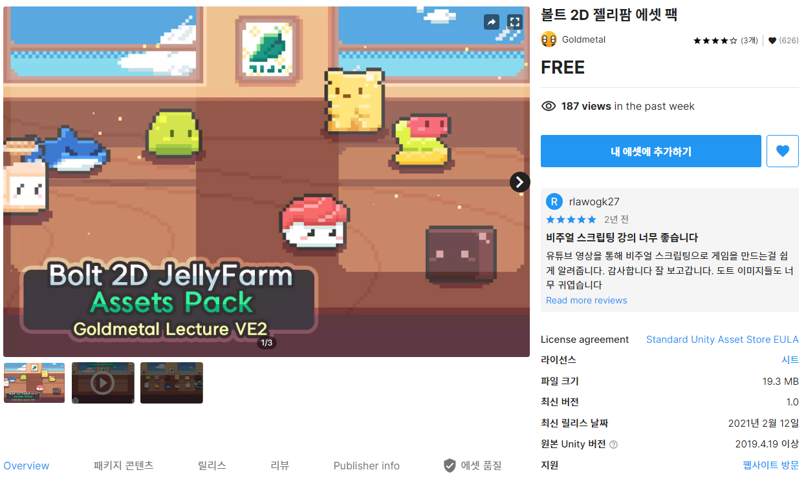
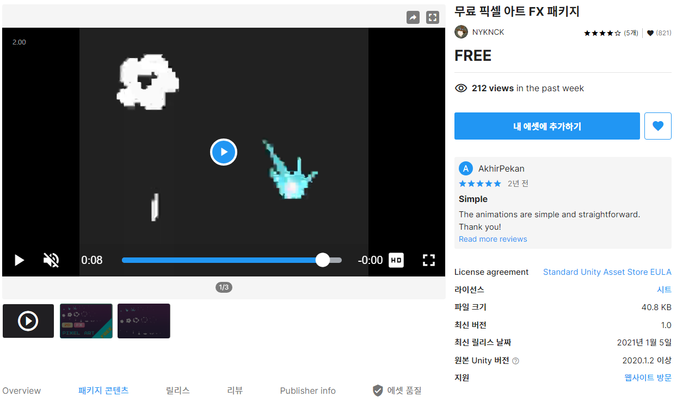
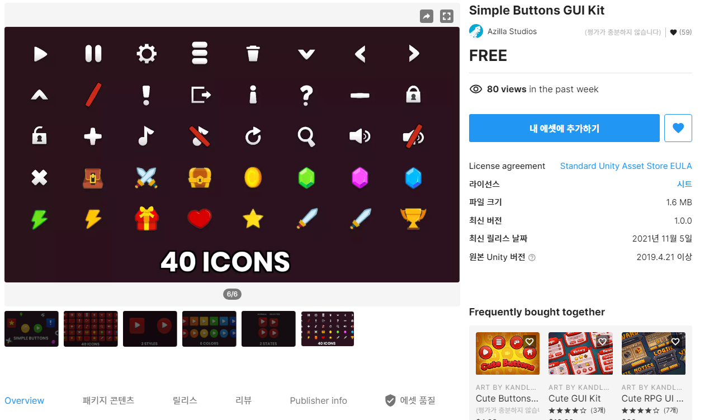
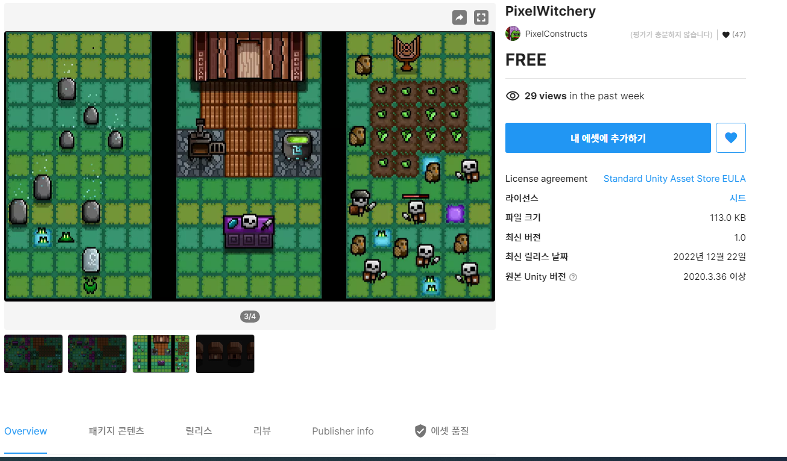
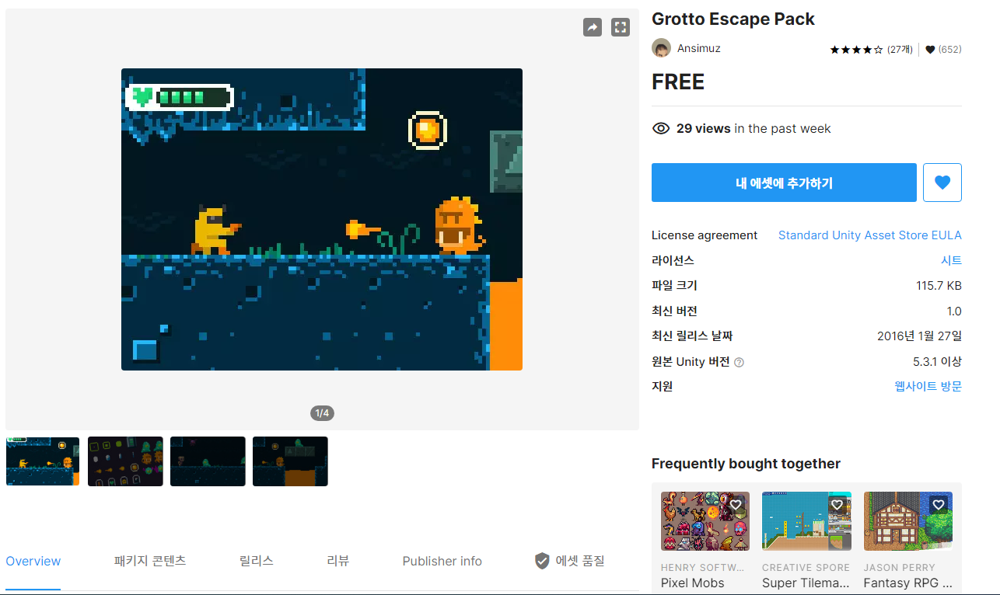

# 20240320FinalProject
> 기간 : 2024.03.20 ~ 05.02
- 프로젝트 명 : **Retro RPG**
- 장르 :  **MMORPG**(대규모 다중 사용자 온라인 롤플레잉 게임)
- 2D/3D : **2D**   

---  

  

📝 **개발일지**  

|개발일자|개발일자|개발일자|이슈발생|
|--|--|--|--|
|[0320:프로젝트 시작](storageFiles/0320.md)|||[0320:문제](storageFiles/trouble/0320Trb.md)|
||||
||||
|||||
|||||  

(RPG 제작하는 팀) 참고: 12,13,15,18,19조

--- 

## 03월 20일 
**최종 프로젝트 시작**  
`게임 개발 입문 강의의 TopDown방식으로 제작하고 아래 요소를 추가 `    

- 필수 구현:
    - 개발 입문 강의를 기초로 TopDown rpg만들기(기초적인 게임 뼈대)
    - 개발 입문 강의의 케릭터에 새로운 무기와 아이템으로 변경
    - 개발 입문 강의의 UI와 맵 등을 변형해서 사용해 보자
    - 개발 입문 강의에서 다룬 다양한 아이템 적용하기
    - 숙련과정에 나온 인벤토리 적용하기(아이템과 상호작용)  

 

- 추가 선택 구현
    - webgl로 빌드(pc나 안드로이드보다 오류가 많아서 추가 구현사항으로)
    - 심화과정의 photon으로 멀티플레이어 적용하기
    - 멀티플레이를 위한 포톤추가(포톤 20명까지 무료)
    - 모바일에서도 호환되게 터치와 조이스틱 키 추가

---

### 참고 자료들  

 
Assets 

### Assets
- 2D Environment Starter Pack: https://assetstore.unity.com/packages/2d/environments/2d-environment-starter-pack-237152

- 볼트 2D 젤리팜 에셋 팩 : https://assetstore.unity.com/packages/2d/characters/bolt-2d-jellyfarm-assets-pack-188722

- Free Pixel Art FX Package : https://assetstore.unity.com/packages/2d/textures-materials/free-pixel-art-fx-package-185612#content  

- Simple Buttons GUI Kit: https://assetstore.unity.com/packages/2d/gui/icons/simple-buttons-gui-kit-203393

- PixelWitchery : https://assetstore.unity.com/packages/2d/pixelwitchery-239673

- Grotto Escape Pack : https://assetstore.unity.com/packages/2d/textures-materials/tiles/grotto-escape-pack-54254

    