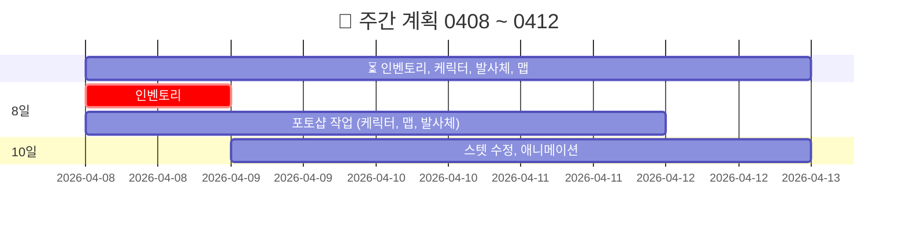
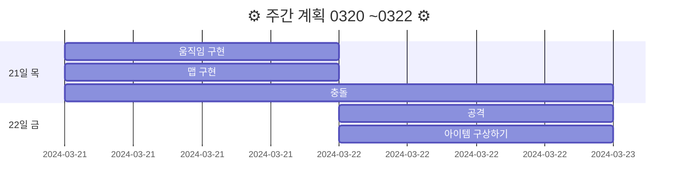
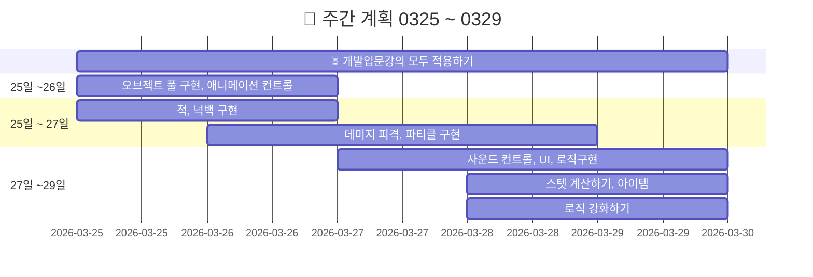
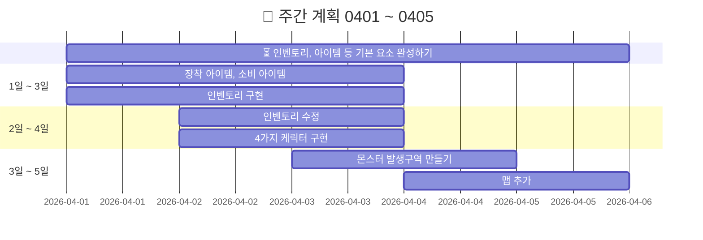

<!-- 주석 -->
<!-- 주석 
```
[](https://hits.seeyoufarm.com)
```


-->


# 20240320FinalProject

<!-- 
[](https://hits.seeyoufarm.com)
-->

> `기간 : 2024.03.20 ~ 05.02`
>- 프로젝트 명 : **Retro RPG**
>- 장르 :  **MMORPG**(대규모 다중 사용자 온라인 롤플레잉 게임)
>- 2D/3D : **2D**


<details >
    <summary >🛠 프로젝트 구현 계획  </summary> 

### 필수 구현사항을 먼저 구현하고 시간이 남으면 선택 사항까지 구현 

`게임 개발 입문 강의의 TopDown방식으로 제작하고 아래 요소를 추가 `    


- 필수 구현:
    - [x] 개발 입문 강의를 기초로 TopDown rpg만들기(기초적인 게임 뼈대)
    - [ ] 개발 입문 강의의 케릭터에 새로운 무기와 아이템으로 변경
    - [ ] 개발 입문 강의의 UI와 맵 등을 변형해서 사용해 보자
    - [ ] 개발 입문 강의에서 다룬 다양한 아이템 적용하기  
    - [ ] ❌ 숙련과정에 나온 인벤토리 적용하기(아이템과 상호작용) :  
---> `2주 정도 시도했지만 기본 지식의 부족으로 포기하고 다른 부분을 먼저 구현하기로 결정 `

<br>

- 추가 선택 구현
    - ✅ webgl로 빌드(pc나 안드로이드보다 오류가 많아서 추가 구현사항으로)
    - [ ] 멀티플레이를 위한 포톤추가(포톤 20명까지 무료)
    - [ ] 모바일에서도 호환되게 터치와 조이스틱 키 추가


</details>    

  

**`브랜치를 백업용으로 사용하면 readme나 개발일지 등의 기록물이 다 이전으로 되돌려지는 문제`** 
- 리드미, 개발일지 등을 다른 리파지토리를 만들어서 연결하면 될까?
  - ---> 다른 리파지토리에서 따로 기록하고 여기에 연결시키는 게 관리하기 좋을 것 같다
- 리드미, 개발일지만 빼고 되돌리기가 가능할까?  


###### RPG 제작하는 팀 참고: 12,13,15,18,19조  
---  


 

<br>  


<details >
    <summary >  ⛔ 문제들과 추가 계획  </summary> 

  
- ❌ **~인벤토리 구현하기~**
- [ ] deathzone 설정하기 --> 맵 테투리에 설정
- [ ] 발사체 별로 충돌 이펙트 --> 강의의 파티클이나 에셋의 스프라이트
- ✅ 몬스터 이동을 안하는 문제
- [ ] 몬스터 애니메이션 
- 🔺 발사체마다 사운드 
- [ ] 그림자 스프라이트 추가하기
- [ ] 아이템마다 AttackSo를 만들고 스탯 구분하기
- [ ] 물약 아이템 statsModifier에 AttackSo추가하기
- ✅ wave 증가마다 몬스터 발생 --> wave삭제하고 스폰 지점에서 발생으로 변경하기
- [ ] 맵 다양화하기 --> 포톤으로 멀티플레이 구현이 힘들 경우 다양한 맵에서 싱글플레이 할 수 있도록
    - [ ] 버블버블,봄버맨,스노우브로스,텀블팝 맵 참고
- [ ] 케릭터 포토샵으로 만들기 : 버블버블,봄버맨,스노우브로스,텀블팝 참고  
https://kjk-dev.notion.site/Spawn-Monster-6786e1326071408382c6f02ed306f935

</details>  


<details >
    <summary >케릭터, 아이템 요약 작성중   </summary> 

|||
|:------:|:------:|
|[물약아이템](storageFiles/아이템/Item.md)||
|케릭터||
|맵||
|장비||
|발사체||
|배경음악|[BGM_03.webm](https://github.com/s8st/20240320FinalProject/assets/153998744/abcd1068-a734-485c-bbb0-cda85fa117e7)|


[BGM_03.webm](https://github.com/s8st/20240320FinalProject/assets/153998744/abcd1068-a734-485c-bbb0-cda85fa117e7)
</details>  


<br>  


https://learn.microsoft.com/ko-kr/dotnet/csharp/    

https://docs.unity3d.com/kr/2022.3/Manual/UnityManual.html  


---  

### `프로젝트에 pun2를 적용하기 위해 먼저 필요한 개념들 정리`

- Resources에 동기화 해야하는 개첵들을 프리팹으로 만들기
- 발사체는 rpc로? --> 고라니tv 다시 확인

 if(photonView.IsMine) 조건을 걸어서 플레이어가 내것인지 검사해서 내것이라면 이동 등을 할 수 있게
 if(!photonView.AmOwner) 방장만 할 수 있는 행위(예로 핑퐁에서 공 스폰하게)
 


---  




### `📝 개발일지  `

|0408 ~ 0412    |      |
|:------------------:|:------------------:|
|[0408:인벤토리](storageFiles/schedule/0408.md)||
|[0409:인벤토리구현](storageFiles/schedule/0409.md)||
|0410 : 선거 휴일| 선거 휴일|
|[0411 : 프로젝트 계획 수정](storageFiles/schedule/0411.md)||
|[0412 : 포톤 공부](storageFiles/schedule/0412.md)||

---  


`📝 개발일지  `

| 0415 ~ 0419   |  문제점    |
|:------------------|------------------:|
|0415 : `포토샵작업` <br>- 게임 참고해서 맵 추가하기<br> - 포톤 ||
|0416 : `포토샵작업`<br>- 물풍선 만들기 <br>- 포톤  ||
|0417 : `포토샵작업`<br>- 스노우브로스 케릭터 추가<br>- 포톤  ||
|0418 : ||
|0419 : ||


--- 

<details >
    <summary > 📝 개발일지 0320 ~ 0322   </summary> 



|0320 ~ 0322|문제점|
|--|--|
|[0320:프로젝트 시작](storageFiles/schedule/0320.md)|[0320:문제](storageFiles/trouble/0320Trb.md)|
|[0321:이동,맵 구현하기](storageFiles/schedule/0321.md)|[0321:이동문제](storageFiles/trouble/0321T.md)|
|[0322:아이템 정리하기](storageFiles/schedule/0322.md)||
</details> 


<details >
    <summary >📝 개발일지 0325 ~ 0329  </summary> 





| 0325 ~ 0329    |  문제점    |
|:------------------:|:------------------:|
|[0325 : 오브젝트 풀](storageFiles/schedule/0325.md)           |           |
|[0326 : 애니메이션,적,피격](storageFiles/schedule/0326.md)          | [0326 : 애니메이션 문제](storageFiles/trouble/0326T.md)           |
|[0327 : 사운드,UI,로직,스탯,아이템 ](storageFiles/schedule/0327.md)           |[0327 : 파티클종류,몬스터이동](storageFiles/trouble/0327T.md)           |
|   [0328:게임 개발 숙련 강의 복습하기 ](storageFiles/schedule/0328.md)       |      [0328 : 깃 충돌](storageFiles/trouble/0328T.md)      |
|        0329   |        [0329 :기존 작업과 새 작업 차이](storageFiles/trouble/0329T.md)    |

</details>  

<details >
    <summary > 📝 개발일지 0401 ~ 0405   </summary> 


### `📝 개발일지  `

| 0401 ~ 0405    |  문제점    |
|:------------------|------------------:|
|0401|[0401:아이템문제](storageFiles/trouble/0401T.md)|
|[0402: 케릭터 선택창](storageFiles/schedule/0402.md)|[0402:시네머신confiner](storageFiles/trouble/0402T.md)|
|[0403: InputSystem](storageFiles/schedule/0403.md)|[0403:스크립트-프리팹오류](storageFiles/trouble/0403T.md)|
|[0404: 몬스터 발생구역 수정하기](storageFiles/schedule/0404.md)|[0404:while문 오류](storageFiles/trouble/0404T.md)|
|[0405:케릭터 선택  ](storageFiles/schedule/0405.md)|[0405: 케릭터선택,인벤토리,아이템,상호작용](storageFiles/trouble/0405T.md)|

</details >


```
Feat 새로운 기능
Fix 버그
Update 문서 등 수정
Test 테스트
Remove 삭제
```


<details >
    <summary > ⚓ 참고 영상  </summary>  

 

<br>

|    |     |   |
|:------------------:|:------------------:|:------------------:|
|[케릭터 선택 방법](https://www.youtube.com/watch?v=pRw_YzkZThc&list=WL&index=1)|[inputsystem 사용법](https://www.youtube.com/watch?v=dsLBzrbo-Vs)|[게코딩 GeCoding](https://www.youtube.com/playlist?list=PLB8IH8T8K71ywWrrY-oKIVd1NBGUmpwh0)|
||||
|[포톤 : 고라니tv](https://www.youtube.com/playlist?list=PL3KKSXoBRRW3YE4UMnRH762vOhSHLdnpK)|[포톤 : 유니티쳐](https://www.youtube.com/playlist?list=PLR7ZBZc9XtFKaHIkPX3p7BETP8XGJLVVs)|[레트로 retr0 :<br>유니티 UNet 멀티플레이어 게임 개발하기](https://www.youtube.com/playlist?list=PLctzObGsrjfxQ6A8KX1heuQaNkL5xMA2D)|
|[레트로 retr0 :<br>유니티 멀티플레이어 네트워크 게임 한방에 만들기](https://www.youtube.com/playlist?list=PLctzObGsrjfwF7kkoraWb235U8Z602gx1)|||


</details>  


---

### `📚 참고 자료들 : `
케릭터,맵,아이템,효과   :  [Assets](storageFiles/References/ref_character_map_fx.md)  
사운드 :  [🔊Audio](storageFiles/References/ref_sound.md) 

---  

<!-- <details >
    <summary >`📝 개발일지  `  </summary> 


||링크|QR|
|--|:--:|:--:|
|0329 입문 강의 완료 <br> - 인벤토리 제작 전<br> - 장착형 아이템 만드는 중 |[webgl test](https://s8st.github.io/20240320FinalProject/)|  |


</details>  
 -->


---  
> ❓ 브랜치의 docs의 webgl도 버전 관리 가능 여부  
> **--> 기능을 추가할 때마다 브랜치를 만들어서 브랜치 별로 webgl 빌드를 하고 main branch의 docs에 저장하면 될 것 같다**


[🎉(클릭) webgl link page](https://s8st.github.io/20240320FinalProject/)

||링크|QR|
|--|:--:|:--:|
|0329 입문 강의 완료 <br> - 인벤토리 제작 전<br> - 장착형 아이템 만드는 중 |[0329 : 1차 빌드 - 개발입문강의](https://s8st.github.io/20240320FinalProject/1/index.html)  |  |
|0406 : 케릭터 선택 구현|[0406 : 2차 빌드 -케릭터 선택까지구현](https://s8st.github.io/20240320FinalProject/2/index.html)||
|0412 : 가능하다면 인벤토리까지<br> 물방울,회오리 발사체 만들기<br>케릭터  |||
|0419 : 19일까지 포톤 멀티플레이 안되면 포기하자|||
|0426 : |||
|0430 : 최종 webgl 빌드|||


<!-- <details >
    <summary >`📝 개발일지  `  </summary> 


`📝 개발일지  `

|    |  문제점    |
|:------------------:|:------------------:|
|||
|||
|||
|||
|||


</details>  
 -->

