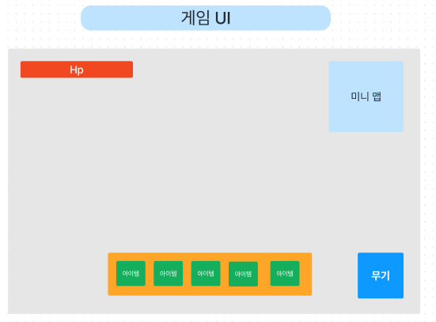
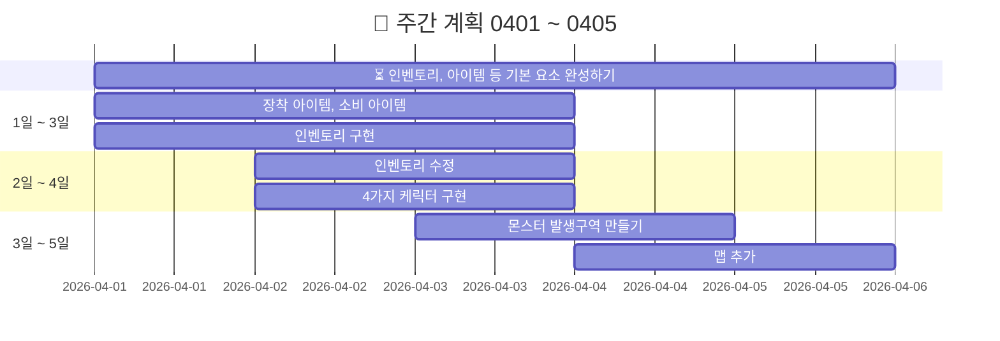
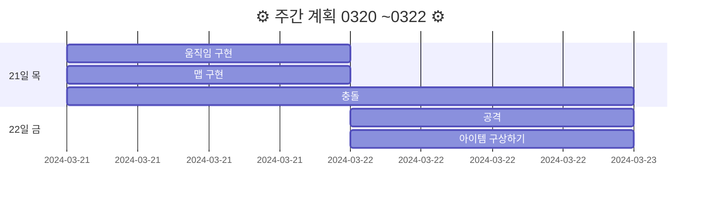
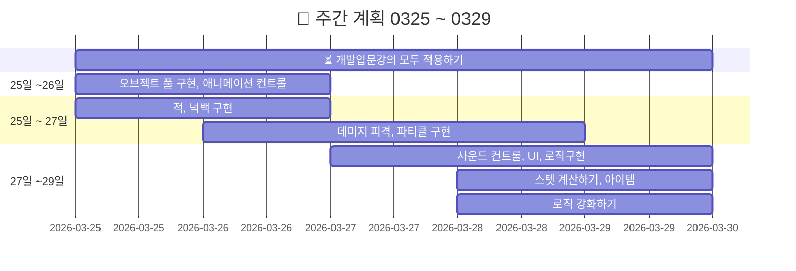

<!-- 주석 -->
ecbkarr12253

79106497118327


# 20240320FinalProject
> 기간 : 2024.03.20 ~ 05.02
- 프로젝트 명 : **Retro RPG**
- 장르 :  **MMORPG**(대규모 다중 사용자 온라인 롤플레잉 게임)
- 2D/3D : **2D**   


<details >
    <summary >🛠 프로젝트 구현 계획  </summary> 

### 필수 구현사항을 먼저 구현하고 시간이 남으면 선택 사항까지 구현 

`게임 개발 입문 강의의 TopDown방식으로 제작하고 아래 요소를 추가 `    


- 필수 구현:
    - [x] 개발 입문 강의를 기초로 TopDown rpg만들기(기초적인 게임 뼈대)
    - [ ] 개발 입문 강의의 케릭터에 새로운 무기와 아이템으로 변경
    - [ ] 개발 입문 강의의 UI와 맵 등을 변형해서 사용해 보자
    - [ ] `개발 입문 강의에서 다룬 다양한 아이템 적용하기 `
        - --> 구체적으로 작성하기

    - [ ] 숙련과정에 나온 인벤토리 적용하기(아이템과 상호작용)  

<br>

- 추가 선택 구현
    - [ ] webgl로 빌드(pc나 안드로이드보다 오류가 많아서 추가 구현사항으로)
    - [ ] 심화과정의 photon으로 멀티플레이어 적용하기
    - [ ] 멀티플레이를 위한 포톤추가(포톤 20명까지 무료)
    - [ ] 모바일에서도 호환되게 터치와 조이스틱 키 추가


</details>    

###### RPG 제작하는 팀 참고: 12,13,15,18,19조  
---  


 

<br>  


<details >
    <summary >  ⛔ 문제들과 추가 계획  </summary> 

  
- [ ] 인벤토리 구현하기
- [ ] deathzone 설정하기 --> 맵 테투리에 설정
- [ ] 발사체 별로 충돌 이펙트 --> 강의의 파티클이나 에셋의 스프라이트
- [ ] 몬스터 이동을 안하는 문제
- [ ] 몬스터 애니메이션 
- [ ] 발사체마다 사운드 
- [ ] 그림자 스프라이트 추가하기
- [ ] 아이템마다 AttackSo를 만들고 스탯 구분하기
- [ ] 물약 아이템 statsModifier에 AttackSo추가하기
- [ ] wave 증가마다 몬스터 발생 --> wave삭제하고 스폰 지점에서 발생으로 변경하기
- [ ] 맵 다양화하기 --> 포톤으로 멀티플레이 구현이 힘들 경우 다양한 맵에서 싱글플레이 할 수 있도록
    - [ ] 버블버블,봄버맨,스노우브로스,텀블팝 맵 참고
- [ ] 케릭터 포토샵으로 만들기 : 버블버블,봄버맨,스노우브로스,텀블팝 참고  
https://kjk-dev.notion.site/Spawn-Monster-6786e1326071408382c6f02ed306f935

</details>  


<details >
    <summary >케릭터, 아이템 요약 작성중   </summary> 

|||
|:------:|:------:|
|[물약아이템](storageFiles/아이템/Item.md)||
|케릭터||
|맵||
|장비||
|발사체||
|배경음악|[BGM_03.webm](https://github.com/s8st/20240320FinalProject/assets/153998744/abcd1068-a734-485c-bbb0-cda85fa117e7)|


[BGM_03.webm](https://github.com/s8st/20240320FinalProject/assets/153998744/abcd1068-a734-485c-bbb0-cda85fa117e7)
</details>  


<br>  

https://www.youtube.com/playlist?list=PLB8IH8T8K71ywWrrY-oKIVd1NBGUmpwh0  


https://learn.microsoft.com/ko-kr/dotnet/csharp/    

https://docs.unity3d.com/kr/2022.3/Manual/UnityManual.html  


- [ ] 4월 5일까지 인벤토리와 아이템 등 완성하기
- [ ] 4월 12일까지 정리한 에셋 적용


---  





### `📝 개발일지  `


| 0401 ~ 0405    |  문제점    |
|:------------------:|:------------------:|
|0401|[0401:아이템문제](storageFiles/trouble/0401T.md)|
|[0402:케릭터 선택창](storageFiles/schedule/0402.md)|[0402:시네머신confiner](storageFiles/trouble/0402T.md)|
|0403|[0403:스크립트-프리팹오류](storageFiles/trouble/0403T.md)|
|0404||
|0405||


--- 

<details >
    <summary > 📝 개발일지 0320 ~ 0322   </summary> 



|0320 ~ 0322|문제점|
|--|--|
|[0320:프로젝트 시작](storageFiles/schedule/0320.md)|[0320:문제](storageFiles/trouble/0320Trb.md)|
|[0321:이동,맵 구현하기](storageFiles/schedule/0321.md)|[0321:이동문제](storageFiles/trouble/0321T.md)|
|[0322:아이템 정리하기](storageFiles/schedule/0322.md)||
</details> 


<details >
    <summary >📝 개발일지 0325 ~ 0329  </summary> 





| 0325 ~ 0329    |  문제점    |
|:------------------:|:------------------:|
|[0325 : 오브젝트 풀](storageFiles/schedule/0325.md)           |           |
|[0326 : 애니메이션,적,피격](storageFiles/schedule/0326.md)          | [0326 : 애니메이션 문제](storageFiles/trouble/0326T.md)           |
|[0327 : 사운드,UI,로직,스탯,아이템 ](storageFiles/schedule/0327.md)           |[0327 : 파티클종류,몬스터이동](storageFiles/trouble/0327T.md)           |
|   [0328:게임 개발 숙련 강의 복습하기 ](storageFiles/schedule/0328.md)       |      [0328 : 깃 충돌](storageFiles/trouble/0328T.md)      |
|        0329   |        [0329 :기존 작업과 새 작업 차이](storageFiles/trouble/0329T.md)    |


</details>  


```
Feat 새로운 기능
Fix 버그
Update 문서 등 수정
Test 테스트
Remove 삭제
```


<details >
    <summary > ⚓ 참고 영상  </summary> 

 


|    |     |
|:------------------:|:------------------:|
|[케릭터 선택 방법](https://www.youtube.com/watch?v=pRw_YzkZThc&list=WL&index=1)||
||[inputsystem 사용법](https://www.youtube.com/watch?v=dsLBzrbo-Vs)|
|||
|||
|||


</details>  


---

### `📚 참고 자료들 : `
케릭터,맵,아이템,효과   :  [Assets](storageFiles/References/ref_character_map_fx.md)  
사운드 :  [🔊Audio](storageFiles/References/ref_sound.md) 

---  

<!-- <details >
    <summary >`📝 개발일지  `  </summary> 


||링크|QR|
|--|:--:|:--:|
|0329 입문 강의 완료 <br> - 인벤토리 제작 전<br> - 장착형 아이템 만드는 중 |[webgl test](https://s8st.github.io/20240320FinalProject/)|  |


</details>  
 -->


---  
> ❓ 확인하기 --> 브랜치의 docs의 webgl도 버전 관리 가능 여부


<!-- <details >
    <summary >`📝 개발일지  `  </summary> 


`📝 개발일지  `

|    |  문제점    |
|:------------------:|:------------------:|
|||
|||
|||
|||
|||


</details>  
 -->

