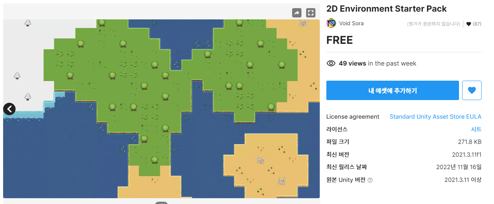
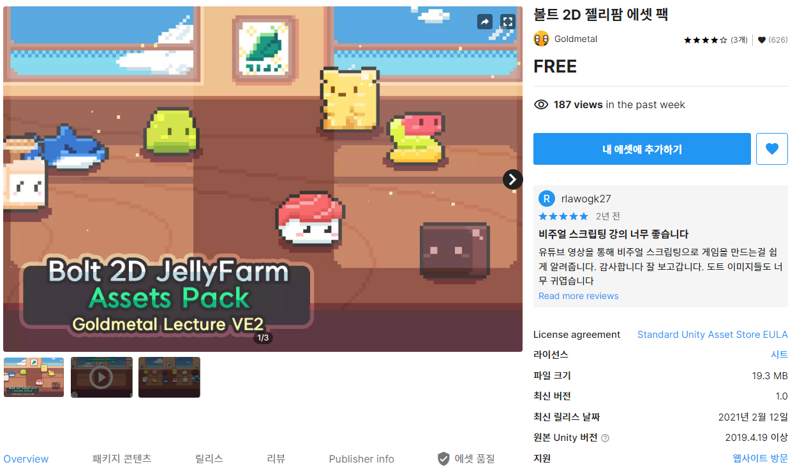
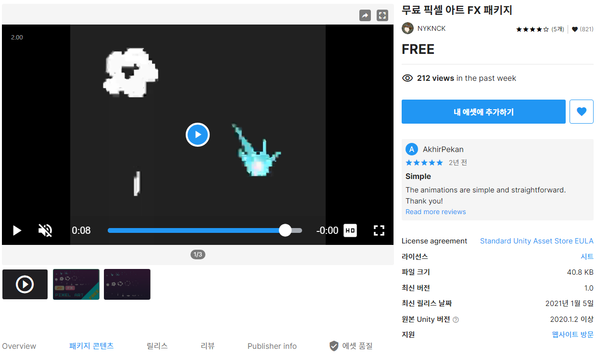
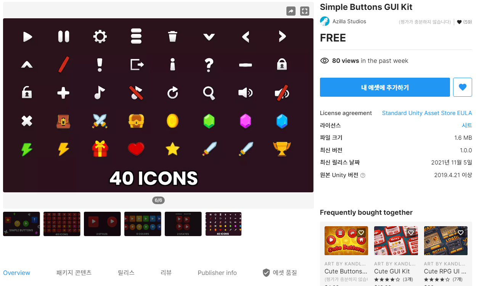
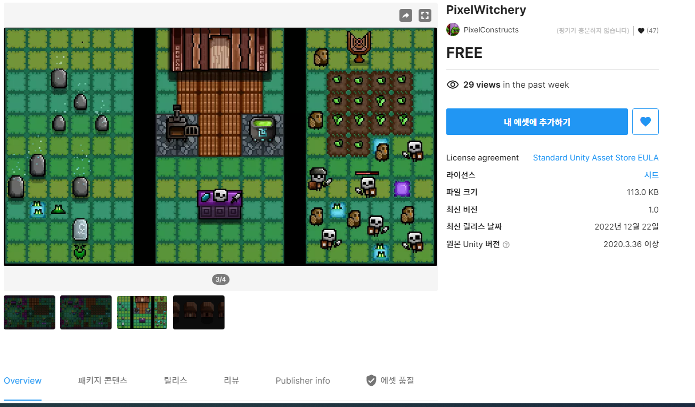
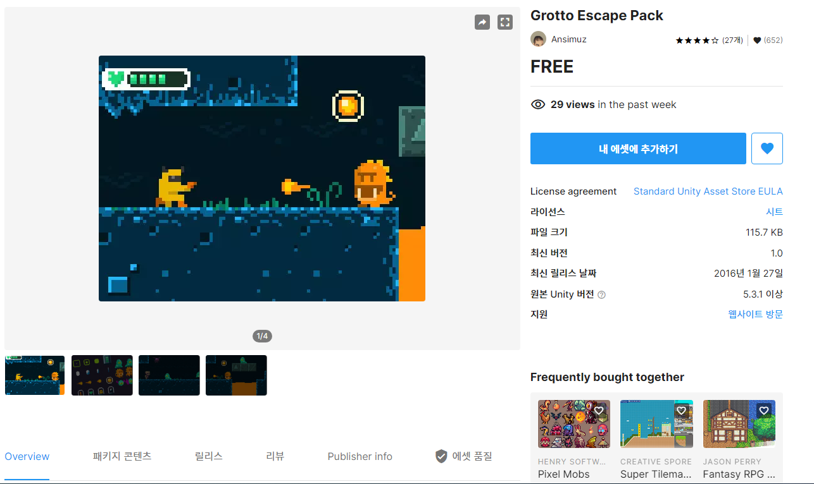
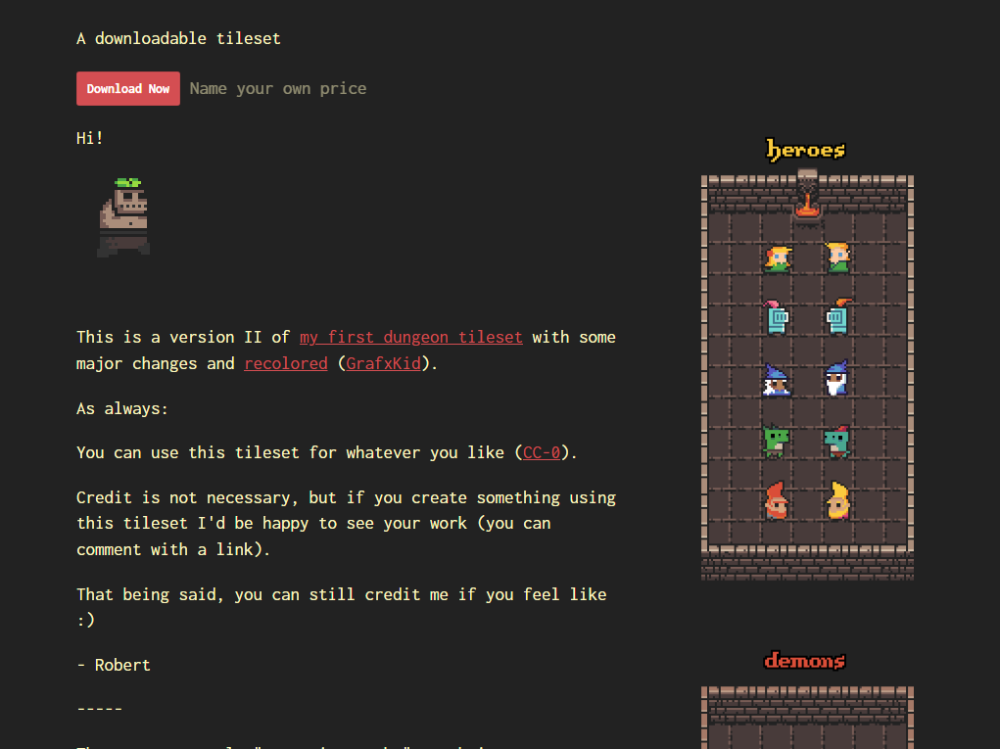
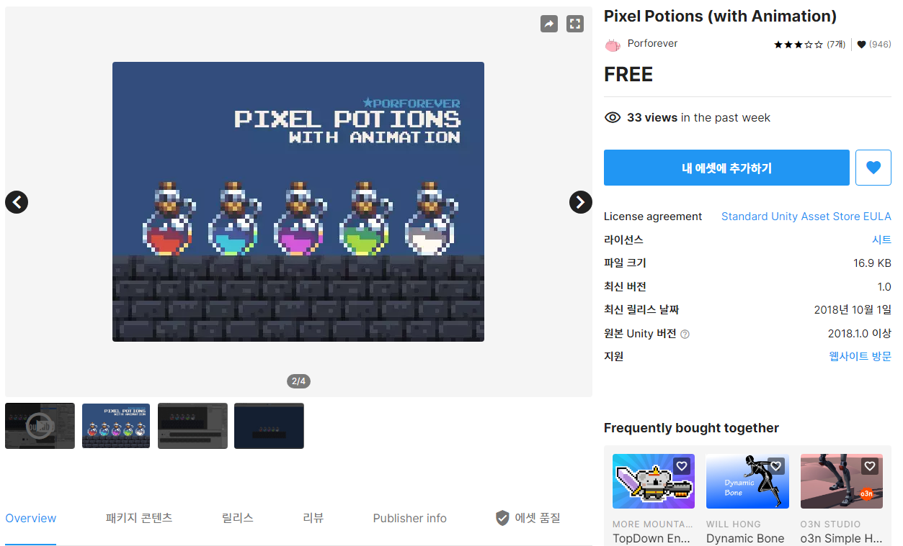
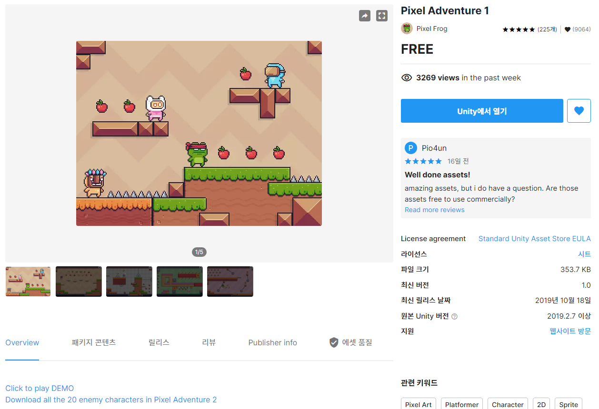

# 참고자료 : 케릭터, 몬스터, 맵, fx

- 2D Environment Starter Pack: https://assetstore.unity.com/packages/2d/environments/2d-environment-starter-pack-237152

- 볼트 2D 젤리팜 에셋 팩 : https://assetstore.unity.com/packages/2d/characters/bolt-2d-jellyfarm-assets-pack-188722

- Free Pixel Art FX Package : https://assetstore.unity.com/packages/2d/textures-materials/free-pixel-art-fx-package-185612#content  

- Simple Buttons GUI Kit: https://assetstore.unity.com/packages/2d/gui/icons/simple-buttons-gui-kit-203393

- PixelWitchery : https://assetstore.unity.com/packages/2d/pixelwitchery-239673

- Grotto Escape Pack : https://assetstore.unity.com/packages/2d/textures-materials/tiles/grotto-escape-pack-54254

- 0x72_DungeonTilesetII_v1.7.zip:  https://0x72.itch.io/dungeontileset-ii

- Pixel Potions (with Animation) : https://assetstore.unity.com/packages/2d/environments/pixel-potions-with-animation-118801

- Pixel Adventure 1 : https://assetstore.unity.com/packages/2d/characters/pixel-adventure-1-155360  
