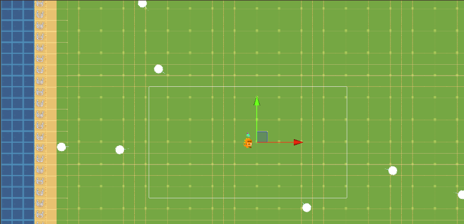
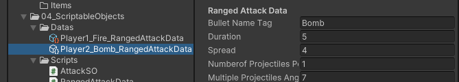

# 0325  
---  
> 오브젝트 풀 구현하기  

- 봄버맨의 폭탄 발사체로 변경

  

- 눈뭉치,물풍선, 진공폭탄 이미지 추가 예정  
--> 케릭터별 발사체를 획득 가능한 아이템으로 

-----  

- 눈뭉치 추가  

- Projectile의 Object Pool 추가  
  

- ScriptableObjects에 폭탄형 발사체 Player2_Bomb_RangedAttackData 추가  
  

- Player 인스펙터에서 AttackSo변경  
 